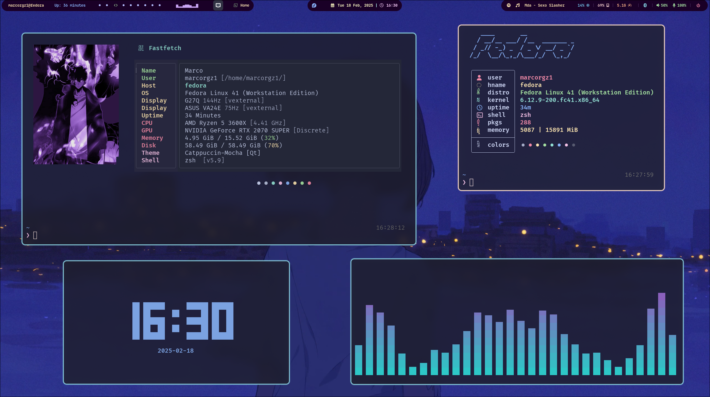

#  My Hyprland dots 

Welcome! This is my dotfiles of my Hyprland environment. A collection of configs based on **Catppuccin Mocha colorscheme.**
Here you are able to clone this repository to copy the config or to get inspiration for your Linux setup. 

## 🛠️ Tools that I used

### 🖥️ Window Manager

- **Window Manager (WM) ->** [Hyprland](https://github.com/hyprwm/Hyprland): A dynamic and light window tile manager to be more productive when using Linux.
- **Top bar:** [Waybar](https://github.com/Alexays/Waybar): A highly customizable bar to make your Linux looks awesome and be more productive.

###  Terminal & Shell

- **Kitty:** A simple terminal with a config file that makes very easy to customize it. Customize with **Catppuccin color scheme**.
- **Zsh:** A shel with a custom config (`.zshrc`) that allows you to use a collection of themes and plugins to improve your experience with the terminal.

### Tools & Utilities

- [**Fastfetch:**](https://github.com/fastfetch-cli/fastfetch) An ultra weight and fast tool that displays your system info. Customize with **Catppuccin color scheme**.
- [**Pfetch:**](https://github.com/dylanaraps/pfetch) Very similar to `fastfetch` but displays less information.
- [**Cava:**](https://github.com/karlstav/cava)  A music visualizer to get vibe with music. 🎶
- [**Yazi:**](https://github.com/sxyazi/yazi) A simple terminal file manager to manage your files easiely. 📒
- [**Rofi:**](https://github.com/davatorium/rofi) A simple and highly customizable app launcher to search your preferred app faster. ⚡

### Graphical System Theme Customization

- [**Nwg-look:**](https://github.com/nwg-piotr/nwg-look) A graphical application to change some features of your Linux theme like the system theme, the icons, the mouse cursor etc. 

###  System preferences

- **Font:** Hack Nerd Font (You can download it [here](https://www.nerdfonts.com/font-downloads))
- **Icon Theme:** [Catppuccin Icon Theme](https://www.gnome-look.org/p/1715570) (Mocha version)





##  Installation

1. Clone this repository:

```sh
git clone https://github.com/marcorgz1/dotfiles.git && cd dotfiles
```

2. Copy all the folders of the `.config` directory and paste them on the `.config` folder located at your home directory:

3. Copy the `wallpapers` folder on your `Pictures` directory.

```sh
cp -r wallpapers/ ~/Pictures
```

> [!NOTE]
> Shortly, I will make an installation script. 😄
